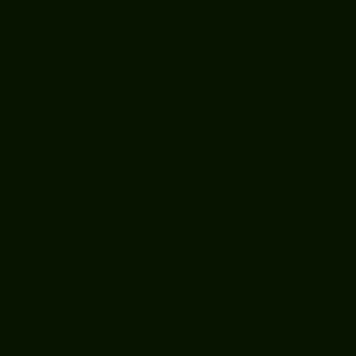
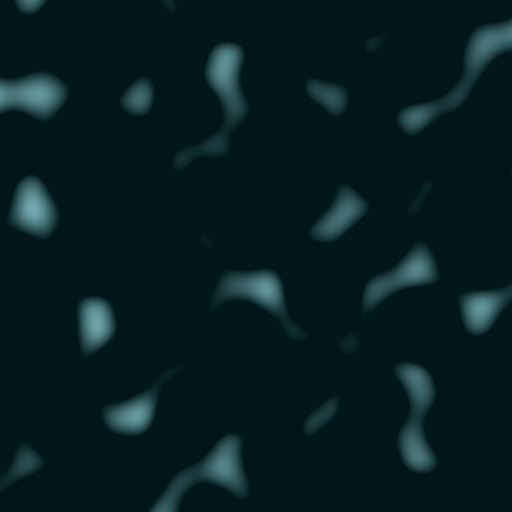
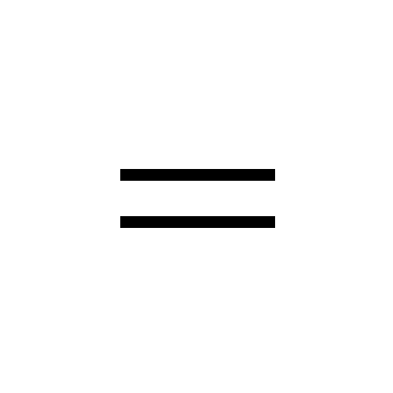
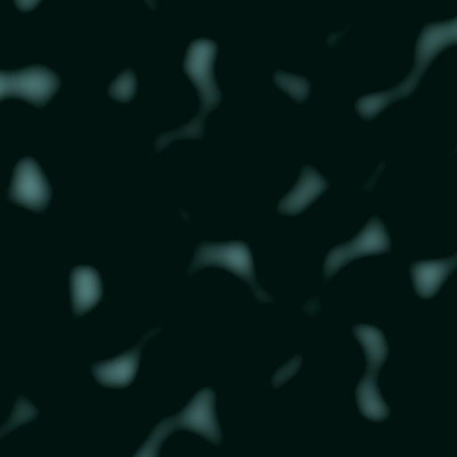
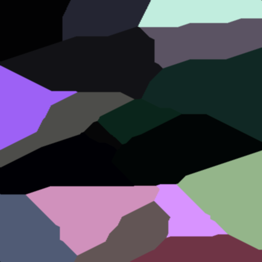
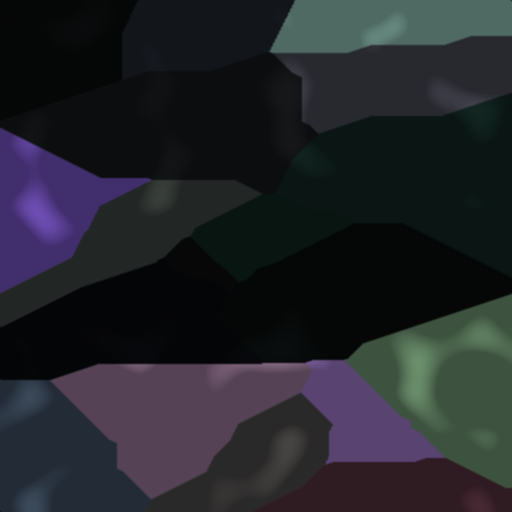
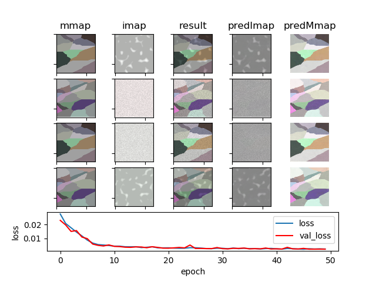
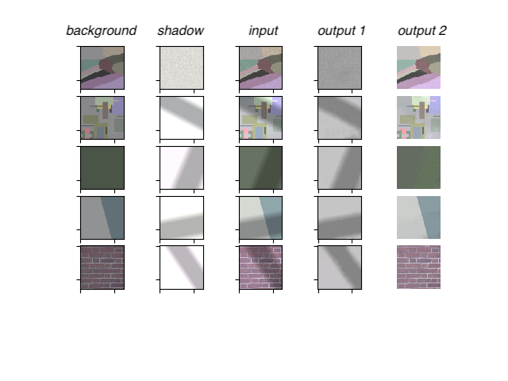

# Intrinsic Image Decomposition

- The overall goal of our summer research is to determine whether raw images perform better at the task of intrinsic image decomposition

- We use the definition of an intrinsic image from [here](http://www-oldurls.inf.ethz.ch/personal/pomarc/courses/CompPhoto/cpv07.pdf)

- The working definition we have of an *intrinsic image* is as follows:
    - the illumination map (first of two parts of an intrinsic image) is the lighting, irrespective of surface material
    - the material map (second part of an intrinsic image) is the surface reflectance, irrespective of lighting

Work sponsored by Colby College Computer Science Department

Members:
Mike Fu
Allen Ma
Professor Bruce Maxwell

Acknowledgments:
Shafat Rahman
Maan Qraitem
Casey Smith

# Explanation of data directory

Our database contains both synthetic and real images of illumination maps and material maps. The synthetic illumination images are generated from stripes, fractal, perlin, and random noises. The synthetic material maps are generated from random polygons stitched together. The real images are taken with a Nikon camera in RAW mode.

Here is a more detailed overhead of our database structure

* data
    * **mmap**; material maps (8000S + 1200R)
        * **mmap_npy**; 512x512 material maps in numpy array form
        * **mmap_real_cr2**; Canon raw, uncropped images of material maps
        * **mmap_real_npy**; uncropped raw material images converted into numpy arrays from 16-bit (linear) tiff
        * **mmap_real_tiff**; 16-bit linear tiffs of the Canon raw images
        * **mmap_synthetic**; 512x512 ppms generated using Bruce's C code
    * **imap**; illumination map (40000S + 1200R)
        * **imap_npy**; 512x512 illumination maps
        * **imap_npy_ambient**; 512x512 ambient illumination maps
        * **imap_npy_direct**; 512x512 direct illumination maps
        * **imap_real_cr2**; Canon raw, uncropped images of illumination maps
        * **imap_real_npy**; uncropped raw illumination images converted into numpy arrays from 16-bit (linear) tiff
        * **imap_real_tiff**; 16-bit linear tiffs of the Canon raw images

We also separated our database into a training set and a test set, using a 80-20 split. Both directories contain both real and synthetic images.

# Example

     
     
    
     
     

Ambient Illumination map + Direct Illumination Map = Illumination map

     
     
    
     
     

Illumination map * Material Map = Final Image

# Results

We tried a variety of networks, including varieties of Deep CNN, and [UNet](https://arxiv.org/pdf/1505.04597.pdf). For our networks, we feed in the Final Image, and the network produces the Illumination  Map and the Material Map.

Our best results feature a two headed UNet, which we coined DualUNet. It is essentially a modification of the UNet architecture that allows it to predict two images instead of one.

We also trained up a simple CNN as a baseline. As we can see, a simpler network can pick up most of the Material Maps, but has trouble with the Illumination Maps

### DualUNet

<!--       -->
<!--       -->
     

# Future Endeavors

Currently, we only trained the networks in linear space. We theorized that using log space, the networks will train better. We also theorized that networks will train better using RAW mode instead of JPEGs
